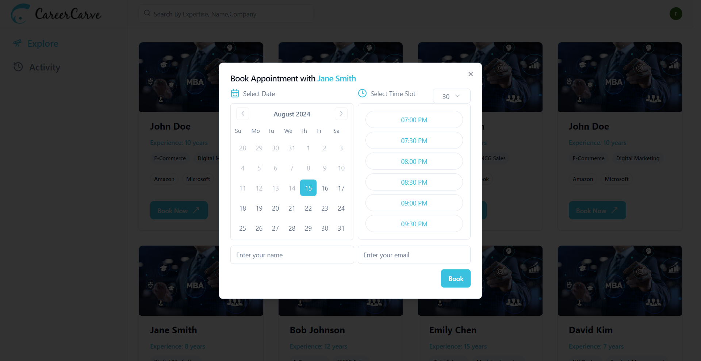

# CareerCarve Server



This is the backend server for the CareerCarve mentorship platform.

## Features

- RESTful API for mentors, students, schedules, and payments
- MongoDB database integration with Prisma ORM
- Email notifications for scheduled sessions

## Setup

1. Clone the repository
2. Navigate to the server directory:
   ```
   cd server
   ```
3. Install dependencies:
   ```
   npm install
   ```
4. Create a `.env` file in the server directory and add the following:
   ```
   DATABASE_URL=<your_mongodb_connection_string>
   EMAIL_USER=<your_email_address>
   EMAIL_PASS=<your_email_password>
   ```
5. Set up the database:
   ```
   npx prisma generate
   npx prisma db push
   ```
6. Start the development server:
   ```
   npm run start
   ```

## API Endpoints

- `/mentors`: CRUD operations for mentors
- `/students`: CRUD operations for students
- `/schedules`: Manage mentorship session schedules
- `/payments`: Handle payment information

## Technologies Used

- Node.js
- Express.js
- TypeScript
- Prisma ORM
- MongoDB
- Nodemailer for email notifications

## Project Structure

- `src/routes`: API route handlers
- `src/emailService.ts`: Email notification service
- `prisma/schema.prisma`: Database schema definition

## Contributing

Please read [CONTRIBUTING.md](CONTRIBUTING.md) for details on our code of conduct and the process for submitting pull requests.

## License

This project is licensed under the MIT License - see the [LICENSE.md](LICENSE.md) file for details.
